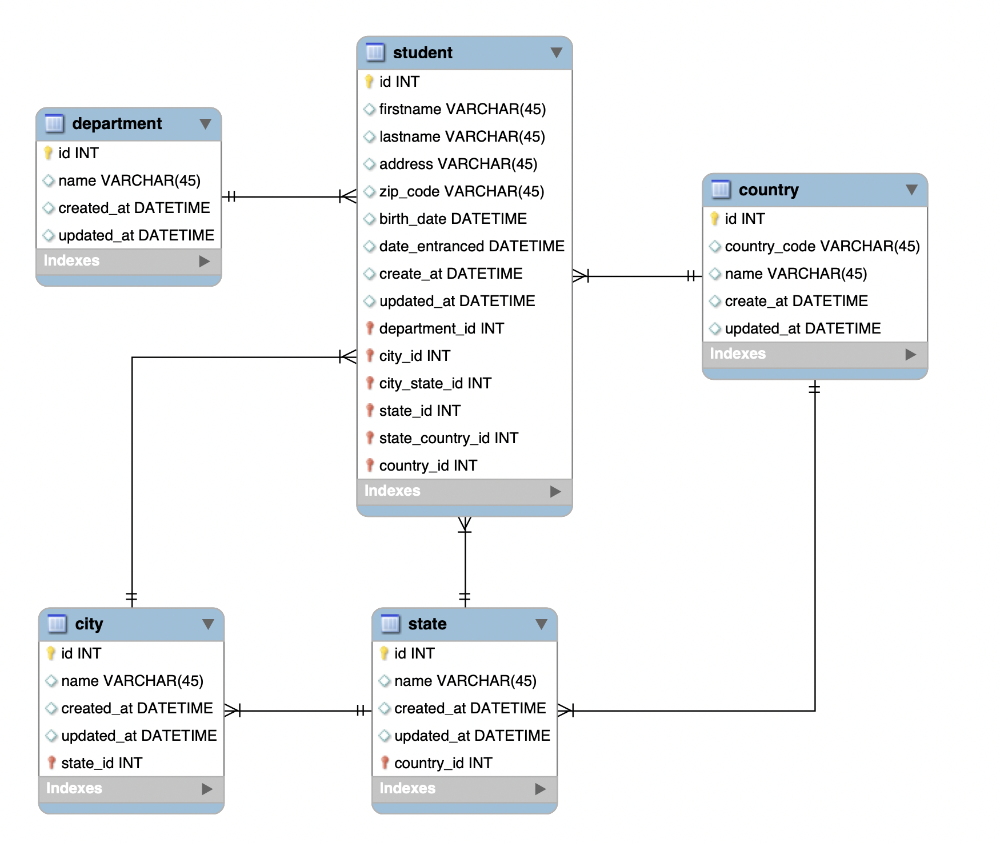
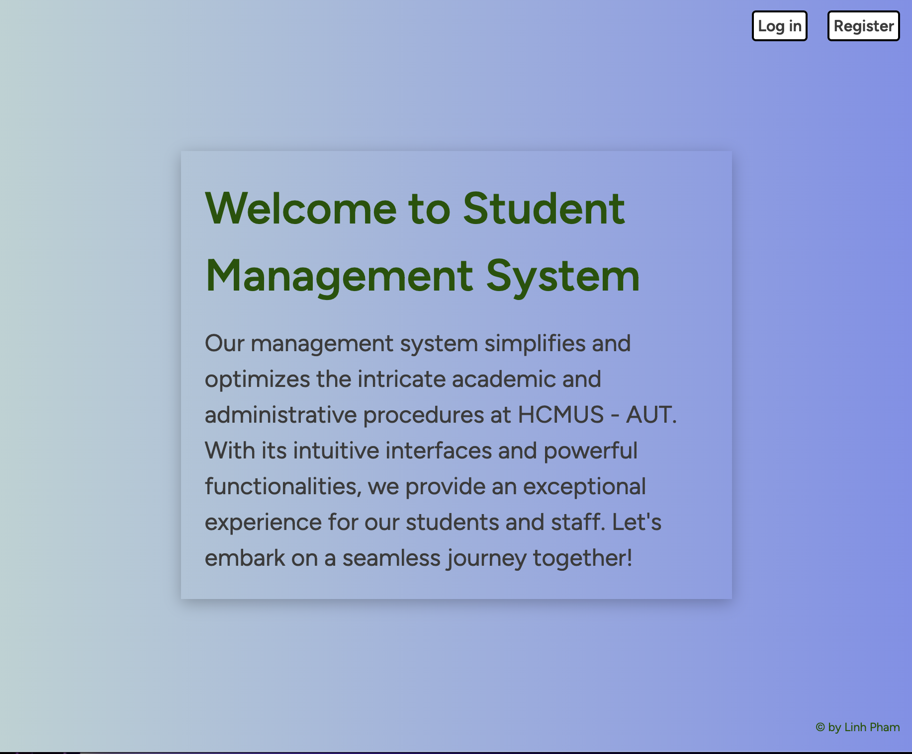
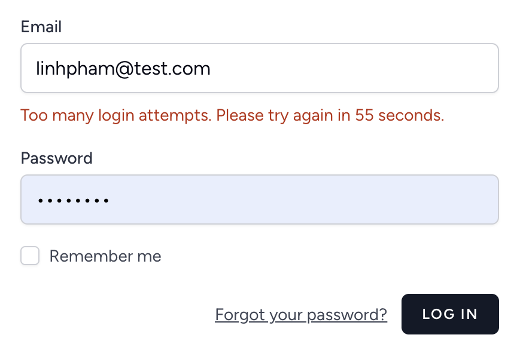
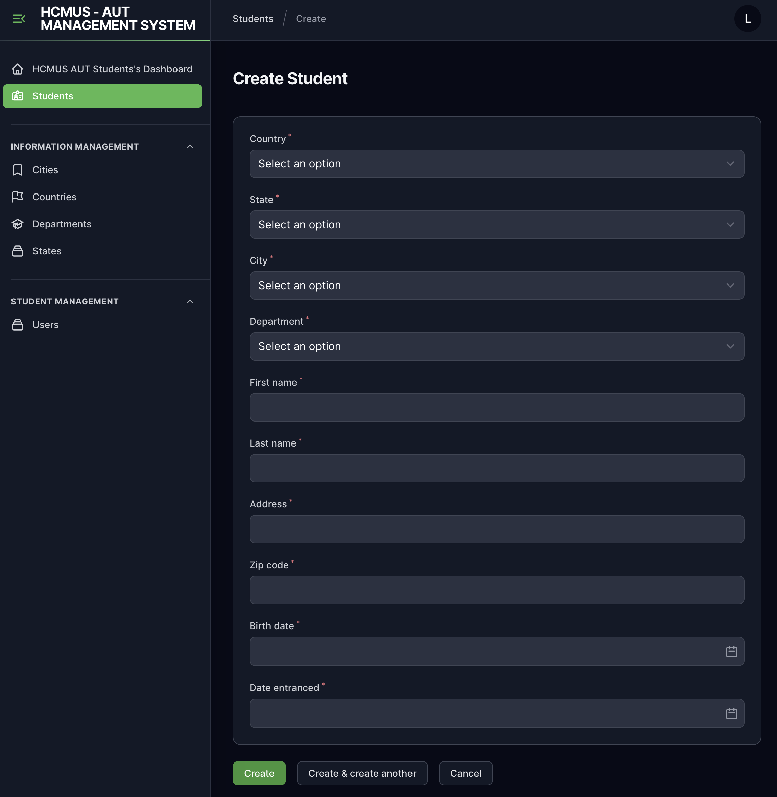
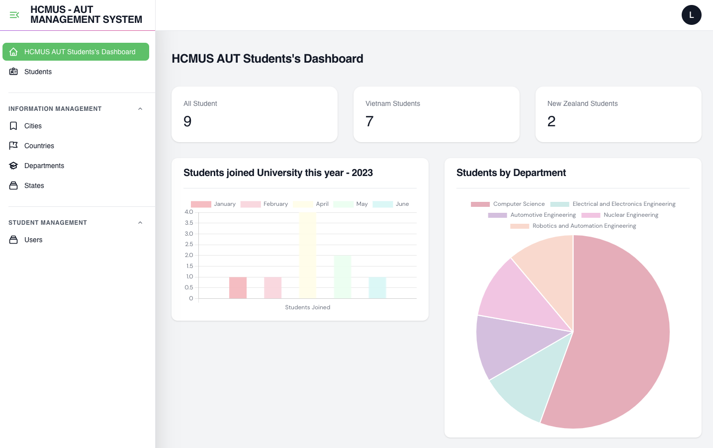
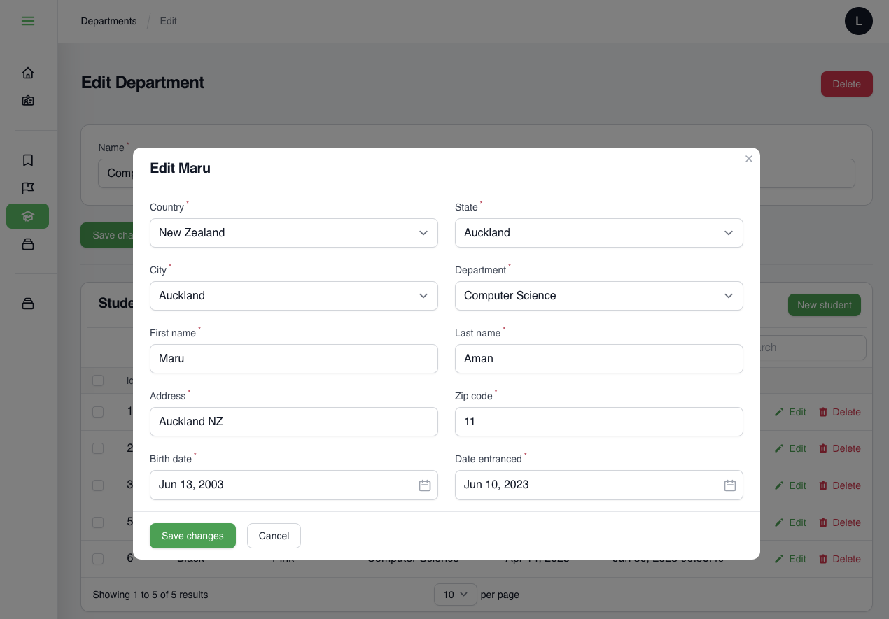

# CS204 - Advanced Web Programming Final Project

| Table of Content |
| --- |
| I/ [Project Summary](#project-summary) |
| II/ [Key Features](#key-features) |
| III/ [Project Design and Architecture](#Project-Design-and-Architecture) |
| IV/ [Installation](#installation) |
| V/ [Demo](#demo) |
_____

## I/ <a id='project-summary'></a>Project Summary

In my final project for Advanced Web Programming, I will develop a Student Management System specifically designed for HCMUS AUT (Ho Chi Minh City University of Science - Auckland University of Technology). The system will be developed using the Laravel framework and will incorporate several key features. The project will showcase my ability to implement the Model-View-Controller (MVC) architectural pattern, perform full CRUD operations, implement user authentication, and create a real-time dashboard with panels and charts.

## II/ <a id='key-features'></a>Key Features

1. Full CRUD Operations:

The system offers Create, Read, Update, and Delete (CRUD) functionality for the core entities. Administrators can manage student records, course details, department information, and enrollment data through user-friendly forms and interfaces.

2. User Authentication:

Implement a login and logout functionality to distinguish between regular users and administrators.
Users will have limited access to their own profile and related information.
Administrators will have privileged access to manage student records, courses, departments, and enrollment data.

3. Dashboard with Panels and Charts:

Create an interactive dashboard that provides an overview of key information and statistics.
Display panels with important metrics, such as the total number of students, courses, and departments.
Generate charts and visualizations to represent data trends, such as enrollment statistics over time or distribution of students across departments.
Make use of charting libraries (Chart.js) to create visually appealing and informative graphics.

## III/ <a id='Project-Design-and-Architecture'></a>Project Design and Architecture

1. Model-View-Controller (MVC) architecture. This design pattern was chosen for its clear separation of concerns and maintainability of the codebase. It provides a robust structure that ensures the scalability of the system:
   
   * Models: Represent the entities in the system, such as Students, Courses, Departments, and Enrollments.
   * Views: Handle the presentation layer, providing a user interface for interacting with the system.
   * Controllers: Handle the business logic, coordinating the actions between the Models and Views.
  
2. Databases:
    * ERD Diagram:
    
    * Database description in detail: <a href="https://github.com/linhlbn/CS204-Advanced-Web-Programming/blob/main/databases_description.md">Click for more information</a>

## IV <a id='installation'></a> Installation


1. Clone the repository: <br>
```$ git clone <repository_url> ```

2. 
   (a) Install Composer: Download from Official website: https://getcomposer.org/download/. After downloading, follow the instructions on the website to install it. Or simply copy paste this command (It worked on my macbook):
    ```
    php -r "copy('https://getcomposer.org/installer', 'composer-setup.php');"
    php -r "if (hash_file('sha384', 'composer-setup.php') === '55ce33d7678c5a611085589f1f3ddf8b3c52d662cd01d4ba75c0ee0459970c2200a51f492d557530c71c15d8dba01eae') { echo 'Installer verified'; } else { echo 'Installer corrupt'; unlink('composer-setup.php'); } echo PHP_EOL;"
    php composer-setup.php
    php -r "unlink('composer-setup.php');"
    ```
    (b) Make it globally accessible: open your bash file and paste this (based on your installation directory then It should work): <br>
    ` export PATH="$PATH:$HOME/.composer/vendor/bin" `

3. Install Laravel: <br>
    ` $ composer global require "laravel/installer" `

4. Install Project Dependencies: Navigate to the project directory in your terminal or command prompt and run the following command to install all the required dependencies: <br> ` $ composer install ` 

5. Install Node.js and NPM: run commands: <br> `$ npm install`

6. Set up the environment file: Make a copy of the .env.example file in the project root directory and rename it to .env.
    <br>
    ` $ cp .env.example .env ` 


    Open the .env file and fill in your database details. Be sure to run the database yourself also.

7. Generate application key: Laravel requires an application encryption key. This can be generated using the following command:
<br> ` $ php artisan key:generate `

8. Run migrations: To create the database tables, use command:
<br> ` $ php artisan migrate`

9. Run the server: Now everything is set up. Start the server:<br> ` $ php artisan serve ` <br>The application should be available at http://localhost:8000 or http://127.0.0.1:8001/.

10.  Compile assets: Make sure CSS & JavaScript files works, run command: <br>
`$ npm run dev`


## V <a id='demo'></a> Demo

* Basic homepage:


* User type wrong password, system postponed the login process:


* Create new student (in dark mode):


* And here is the Admin Dashboard:


* Update the student information by choosen Department (Computer Science)

